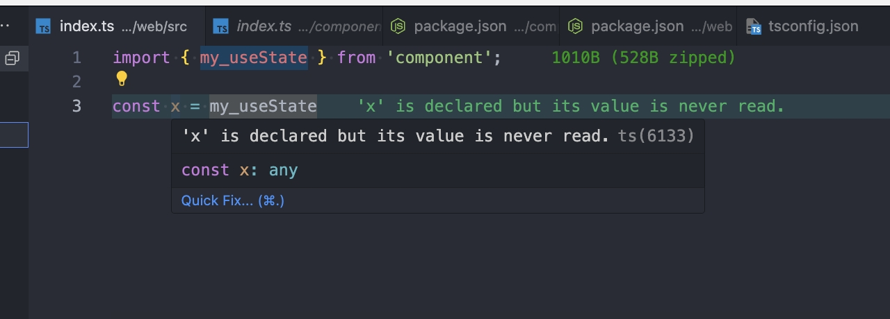

# Why you should add @types/react to your peerDependencies

This is a minimal implementation that shows the troubles of @types/react as a phantom dependency on end users.

```json
// package.json
{
  "name": "axx-design",
  // ...
  "devDependencies": {
    "react": "18.2.0",
    "react-dom": "18.2.0",
    "@types/react": "18.2.38",
    "@types/react-dom": "18.2.38"
  },
  "peerDependencies": {
    "react": ">=16.8.0",
    "react-dom": ">=16.8.0",
  },
  // ...
}
```

```ini
; .npmrc
; turn on the strict mode of isolated-node_modules
hoist-pattern=[]
public-hoist-pattern=[]
```



In most cases, use npm or yarn or non-strict pnpm allows the existence of phantom dependencies by default, so you can use it normally, but whether the type is correct depends on your luck.

So do all other @types packages
